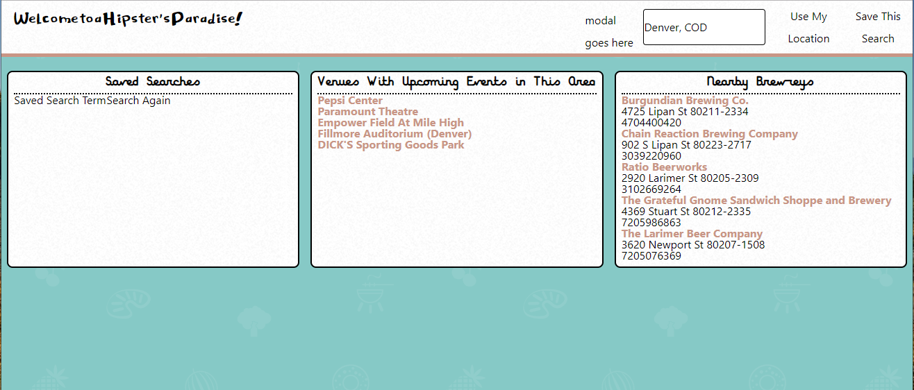

# Project1

# Project Overview:
```
A simple web page that allows users to enter a city/state and/or zipcode to see nearby Ticketmaster events coupled with nearby Brewreys. The page also allows for users to save their searches for later use.
```

# Project Requirements:
```
Display Requirements:
    1. Header
        a. Location input box
        b. "Use My Location" button
        c. "Save This Search" button

    2. Saved Searches Panel
        a. Displays the user's previously saved searches

    3. Event Venue Panel
        a. Displays list of Ticketmaster links for upcoming events listed by venue

    4. Brewreys Panel
        a. Displays a list of nearby brewreys including name, address, and phone number.

    5. Panels display data using jQuery generated tables

Logic Requirements:
    1. Location input logic must validate entered locations using SmartyStreets API
    2. Location details must be pulled from OpenStreets API
    3. Brewery information must be pulled from OpenBrewreys API
    4. Ajax to be used for API queries
    5. Firebase DB to be used for saving/retrieving user searches
 
Technology Requirements:
    1. Page Layout
        a. HTML
        b. CSS
        c. Tailwind CSS
    2. Data Logic
        a. Javascript
        b. Ajax
    3. DOM manipulation
        a. jQuery
    4. Database
        a. Firebase
```
 
 ### Link to Page: https://kbrowngithub.github.io/Project1/
 
 # Features
 #####
```
 
 Display Screen

 ```
 
 
 ```